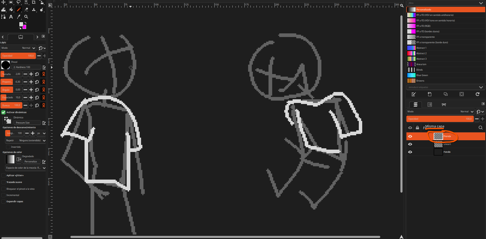

# Dress95. Desarrollo.

## ¿Cómo empezó?
Mientras estaba en la preparatoria, empecé a dibujar en tiempo libre. Intenté recrear una cara de pereza
de Applejack de memoria, a mi estilo usando un personaje al azar antropomórfico. Sin embargo, de repente
se me vino a la cabeza los juegos de vestir . . .

Así que quise hacer uno, pero en vez de simplemente vestir . . . lo ideé como contrarreloj.

## ¿Qué historia tiene?

Kimberly, una zorrillo muy ocupada, es muy selectiva respecto a su forma de vestir. Tú, siendo amigo/a suya,
le ayudas eligiendo las prendas, pero de último momento antes de su cita. Tienes que recrear las referencias
rápidamente, o Kimberly se irá avergonzada.

## ¿En qué se basa?

1. Inspiración en los videojuegos flash de vestir.
2. Videojuegos arcade/casuales contrarreloj
3. Prendas de los 90s

## ¿Qué se pide exactamente?

Durante las partidas, Kimberly hace poses para estrenar su vestimenta.

### Técnico
Como Kimberly puede posar en cinco poses distintas, cada prenda debe tener cuatro variantes que se adapten a
la pose de Kimberly.

Hipotéticamente, harías la misma prenda tomando
como referencia las poses de Kimberly.

Después, se acomodarán en un spritesheet.
Ntp, se ajustarán a Kimberly mediante código.

### ¿Cómo podría verse?

